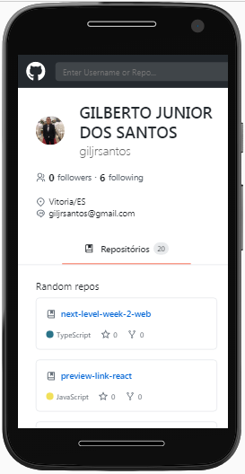
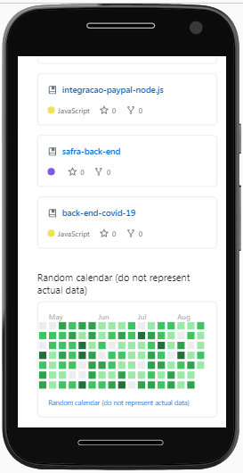
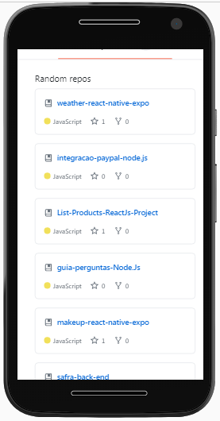
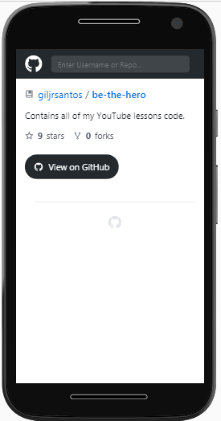
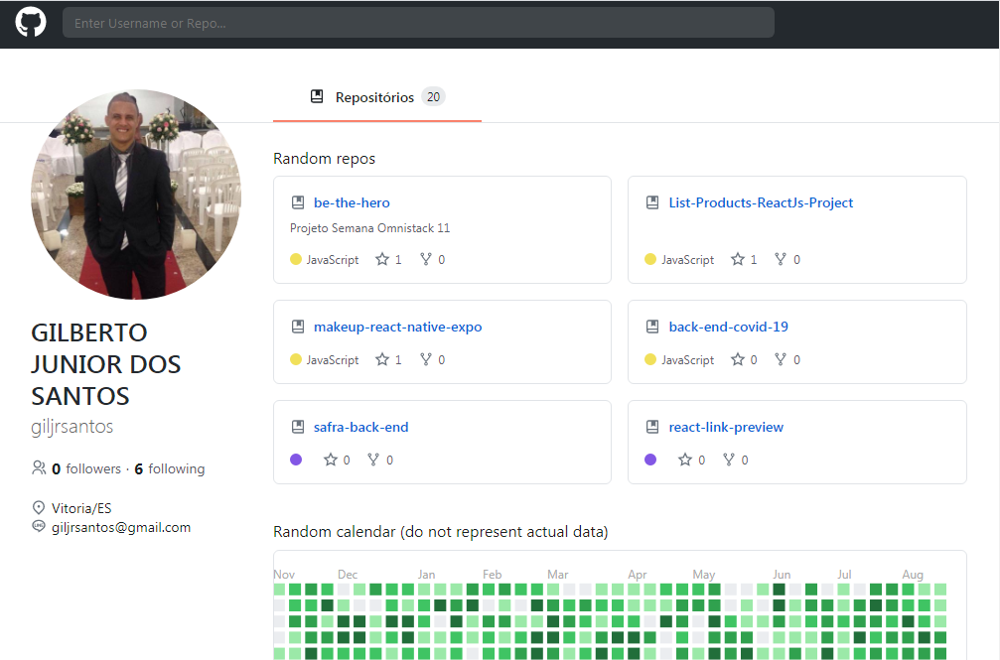
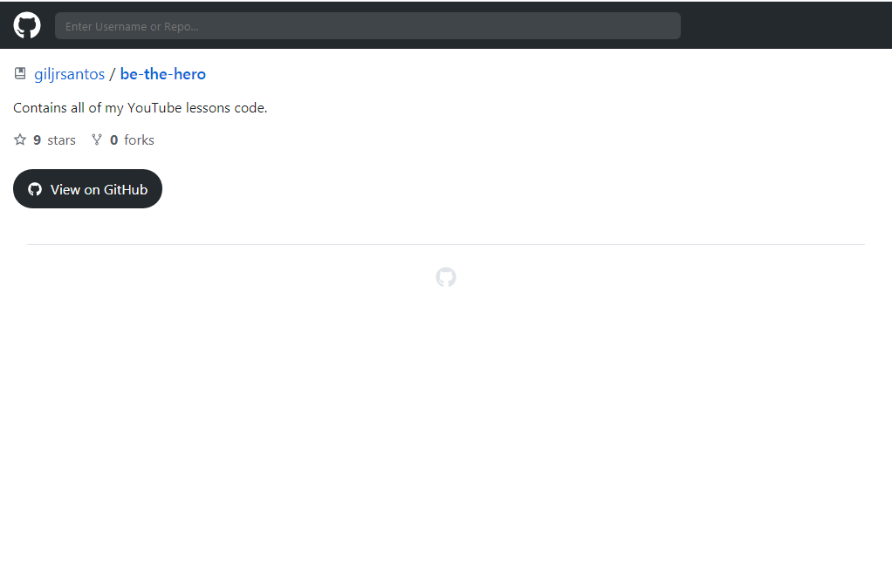

# Interface GitHub com ReactJs | UI Clone

Esse aplicativo ele recupera os dodos da API do GitHub.

Apos recuperar os dados, e transformar para `JSON` os dados são exibidos na tela.

Foi feito um tratamento, se o usuário informar um nome que não existe no cadastro do `GITHUB` o sistema retorna com a mensagem de erro `User not found!`.

A aplicação foi desenvolvida para tela de `desktop` e `mobile`.

# *API Desenvolvida com:* 
            * ReactJs

    -   O projeto foi criado com --template=typescript

# *Dependências:* 
            * axios
            * react
            * react-dom
            * react-router-dom
            * typescript

### `yarn start` ou `npm start`

Ao executar o aplicativo, o projeto vai abrir automaticamente no endereço [http://localhost:3000](http://localhost:3000).

Qualquer edição que você fizer no arquivo, a página sera recarregada. 

Você também verá os erros no console.

# *OBSERVAÇÃO:*

## Funcionalidades
-   Quando a pessoa informa o nome do usuário do `GitHub` e aperta a tecla `ENTER` o sistma vai efetuar a busca dos dados e dos repositórios. Trazendo `nome, login, followers, following, companhia, endereço, e-mail`

    Vai ser listado 6 repositórios aleatórios. E vai trazer a quantidade de `stars, forks` 

# Versão Mobile

# Versão Desktop

